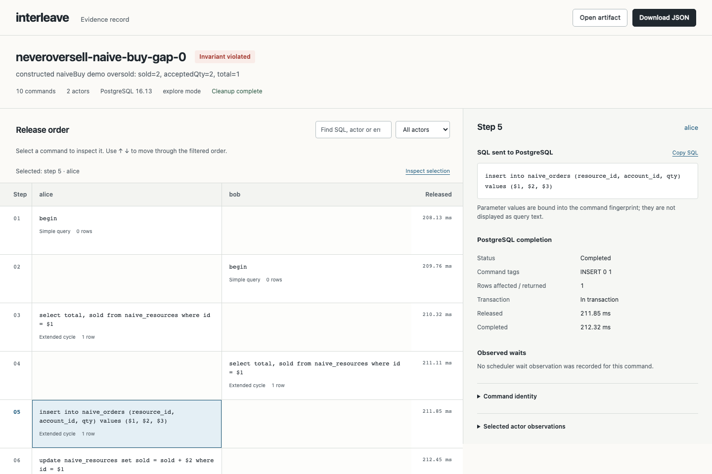

# Interleave

Find a Postgres race in real application code, then keep the failing order as a regression test.

Interleave runs your concurrent operations against real PostgreSQL through a local proxy. You supply setup and a business invariant; it controls command release order and records the evidence for replay. Use it to investigate intermittent database failures and test operations that must stay correct when they overlap.



This actual run of [neveroversell's unchanged unsafe operation](examples/neveroversell/README.md) sold the last unit twice, with its optional delay set to zero. It is an owned demonstration, not a historical production defect.

The library, CLI, offline viewer and supported regression exports are implemented. There is no stable release yet. Start from a source checkout or build a local package using the [installation guide](docs/getting-started.md).

## Run an example and open the evidence

You need Git, Node.js 22.18+ and a running Docker engine. Run these commands in a POSIX shell:

```sh
git clone https://github.com/pavangupta352/interleave.git
cd interleave
npm ci
npm run build
unset TEST_DATABASE_URL
node dist/cli.js doctor --docker

if node dist/cli.js demo neveroversell --docker --out failure.interleave.json; then
  interleave_status=0
else
  interleave_status=$?
fi
test "$interleave_status" -eq 1

node dist/cli.js report failure.interleave.json --out failure.html
node dist/cli.js demo neveroversell --docker --safe
```

Open `failure.html` in your browser. The unsafe demo must exit 1 because its invariant fails; the explicit status check above treats any other result as an error. `doctor`, report creation and the safe demo should exit 0. Run the commands in order and stop if a check fails.

`--docker` starts an owned PostgreSQL 16 container on a random loopback port and removes it and its volumes when the command ends, including failure or interruption. The first run may download the image. Each execution inside a command gets a fresh generated database. If you already have a dedicated test administrator URL, omit `--docker` and set `TEST_DATABASE_URL`; see [both setup routes](docs/getting-started.md#choose-your-postgresql-server).

Reports work offline without a server and never execute application code. Output files must be new, or explicitly replaced with `--force`. SQL, errors and selected actor observations can contain private data; review them before sharing.

## Test your own operation

A scenario has setup, two to eight named concurrent operations called actors, and an invariant. Each actor receives a proxy URL and calls your existing application function with its own database client. Setup and the invariant use a direct connection to the fresh database.

The [application guide](docs/application-guide.md) walks through a complete imported business module, client injection, fixture setup, recording and replay. The [concepts guide](docs/concepts.md) explains plans, release versus completion, and the different outcomes.

| Task | Command or API | What it establishes |
| --- | --- | --- |
| Look for a failing order | `run` / `explore` | Observations from bounded actor-choice exploration |
| Reproduce recorded inputs and ordering | `replay` | The recorded command and wait contract against captured starting conditions |
| Simplify a failure | `minimize` | Fewer explicit actor choices while retaining the same invariant failure |
| Inspect or move a recorded case | `report` / `export` | Offline evidence, or the supported original-source regression bundle |

Prefer scenario files for supervised execution and source identity. Exact file replay checks source, installed dependencies, runtime, fixture and actor connections. It observes results again; row counts, actor values and the invariant outcome can differ. After a source repair, use a guided rerun or fresh exploration. The [regression and CI guide](docs/ci.md) shows how to retain the original case and check the changed code without treating an incompatible or budget-stopped run as a pass.

Minimization removes ordering instructions, while application SQL still executes under the runner's fallback policy. Its minimality is local to that policy. Search defaults to FIFO; an optional seed selects pending prefixes deterministically when observations match. Preserve the artifact for exact replay. A seed does not freeze external inputs, and a passing bounded search does not prove race freedom.

## Tested scope

| Starting point | Scope and example |
| --- | --- |
| node-postgres 8.23.0 | Native PostgreSQL 16/17/18; [application counter](examples/application/README.md) and [neveroversell](examples/neveroversell/README.md) |
| Postgres.js 3.4.9 | Parameterized queries with the explicit [`describe-flush-v1` profile](examples/postgresjs/README.md) |
| pghybrid 0.1.4 | Four pinned public search adapters on PostgreSQL 17 with pgvector 0.8.6; [caller and shutdown boundaries](examples/pghybrid/README.md) |

The [compatibility matrix](docs/compatibility.md) records exact server/runtime versions, Node.js 22.18.0/24.7.0 qualification, and the limits of each profile. A qualified adapter workload does not establish support for every feature of its driver or ORM.

The proxy preserves protocol bytes. PostgreSQL owns statement execution, locks and resumption. SQL batches remain intact; server-side functions are opaque. The native fixture profile permits `plpgsql` and rejects other extensions; pgvector has a separate explicit profile. Unsupported protocol and fixture features fail explicitly. Clocks, randomness and external services remain uncontrolled.

## Documentation and help

Start with the [documentation index](docs/README.md), [CLI reference](docs/cli.md), or [API reference](docs/api.md). Use [troubleshooting](docs/troubleshooting.md) to interpret a stopped run, and [open a reproducible issue](https://github.com/pavangupta352/interleave/issues/new?template=bug_report.md) if needed. Report vulnerabilities through the [private security route](SECURITY.md).

`npm test` runs the native unit and integration suites with an owned PostgreSQL container unless you supply a dedicated URL. `npm run test:unit` needs neither PostgreSQL nor Docker. See [contributing](CONTRIBUTING.md) for checks, [validation](docs/validation.md) for dated evidence, and the [implementation checklist](docs/plans/implementation.md) for remaining acceptance work.

## Related work and license

[PostgreSQL's isolation tester](https://github.com/postgres/postgres/blob/master/src/test/isolation/README) already explores interleavings of authored SQL sessions. Interleave focuses on existing application operations and their replay evidence. [determined](https://github.com/glideapps/determined) provides deterministic TypeScript simulation primitives; [Antithesis](https://antithesis.com/) controls a broader execution environment.

[MIT](LICENSE) © Pavan Gupta. Vendored application source and bundled dependencies retain their own [neveroversell](examples/neveroversell/vendor/LICENSE), [pghybrid](examples/pghybrid/vendor/LICENSE) and other required license notices.
