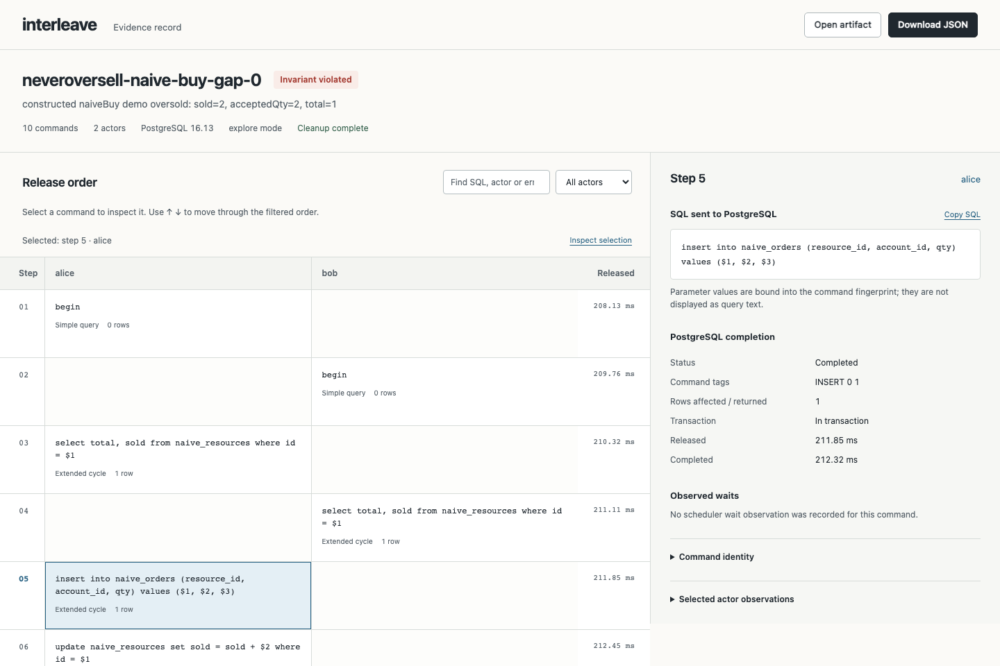

# Interleave

Interleave reproduces race conditions in PostgreSQL application code. It records
the order of SQL commands that broke your data and keeps that order as a
regression test.

Two requests read the same row, both write, and one update disappears. It shows
up in production and never in your test suite, because the tests never hit the
one order that breaks it. Interleave runs your actual operations against a real
PostgreSQL server and decides the order in which their SQL commands reach it, so
you can produce that order deliberately and repeat it.



## What it looks like

Take an ordinary read-then-write operation:

```js
// counter.mjs — your application code, unchanged
export async function incrementCounter(client, id) {
  const { rows } = await client.query('SELECT value FROM counters WHERE id = $1', [id]);
  const value = rows[0].value + 1;
  await client.query('UPDATE counters SET value = $1 WHERE id = $2', [value, id]);
  return value;
}
```

A scenario names the concurrent operations (actors), sets up the database and
states the rule that must hold. Each actor gets its own connection string and
calls your code:

```js
// scenario.mjs
import assert from 'node:assert/strict';
import { Client } from 'pg';
import { defineScenario } from '@pavangupta352/interleave';
import { incrementCounter } from './counter.mjs';

async function increment({ connectionString }) {
  const client = new Client({ connectionString });
  await client.connect();
  try { return { value: await incrementCounter(client, 1) }; }
  finally { await client.end(); }
}

export default defineScenario({
  name: 'application-counter',
  async setup({ db }) {
    await db.query('CREATE TABLE counters (id int PRIMARY KEY, value int NOT NULL)');
    await db.query('INSERT INTO counters VALUES (1, 0)');
  },
  actors: { alice: increment, bob: increment },
  async invariant({ db }) {
    const { rows } = await db.query('SELECT value FROM counters WHERE id = 1');
    assert.equal(rows[0].value, 2, 'Both increments must be retained');
  },
});
```

Then let Interleave find the order that breaks it, replay it and shrink it. This
output comes from a real run, shortened where the CLI repeats the search's scope
note, each run's summary and the assertion's detail (`1 !== 2`):

```console
$ npx interleave run scenario.mjs --docker --out failure.json
application-counter: 1 attempted, 1 completed; violations: 1; failure.
Search: fifo; pending prefixes: 0; maximum attempted depth: 0.
Recorded release units: 4; actor switches: 3.

$ npx interleave replay scenario.mjs failure.json --docker
application-counter: violation (replay); 4 commands; cleanup complete.
Both increments must be retained

$ npx interleave minimize scenario.mjs failure.json --docker --out minimal.json
Reduced 4 choices to 0 in 4 attempts; locally-minimal.

$ npx interleave report failure.json --out failure.html
Wrote offline evidence report: failure.html
```

Exit codes are meant for CI: `0` checked success, `1` invariant violation, `3`
incompatible replay, `4` inconclusive or budget exhausted. `--docker` starts a
throwaway PostgreSQL container and removes it afterwards; you can point Interleave
at a dedicated test server instead.

## How it works

```text
 alice ──► proxy A ──┐                                  ┌──► real PostgreSQL
                     ├──► scheduler: releases one ──────┤    (executes, locks,
 bob   ──► proxy B ──┘    command at a time, observes   │     reports waits)
                          completions and lock waits    └──► invariant check
```

- Each actor connects to its own local proxy. The proxy forwards the original
  protocol bytes and never rewrites or re-executes SQL.
- The scheduler holds each command until it chooses to release it, then waits
  for PostgreSQL to finish it or for a lock wait that PostgreSQL itself reports.
  With `--overlap pairs`, a search can also release two commands together and
  let PostgreSQL interleave them, which reaches races inside one statement.
- A bounded search tries different release orders. When the invariant fails,
  the order, SQL, results and waits are saved as a JSON artifact.
- The artifact records what makes the run repeatable: your source files,
  installed dependencies, Node.js and PostgreSQL versions, the starting database
  and the connection settings. If any of them changed, exact replay reports the
  run as incompatible instead of executing it. After you fix the code, a guided
  rerun or a fresh search checks the change as new evidence.

## Commands

| Command | What it does |
| --- | --- |
| `run` | Explores command orders and saves the first failing one |
| `replay` | Reruns a saved failure exactly, or `--guided` against changed code |
| `minimize` | Removes ordering choices while keeping the same failure |
| `report` | Writes a standalone HTML evidence viewer that works offline |
| `export` | Packages the failing source, lockfile and runtime so the failure replays elsewhere, offline |
| `doctor`, `demo` | Checks your setup; runs a built-in oversell example |
| `init` | Scaffolds a scenario in an existing project |

The same workflow is available from JavaScript: `explore`, `runOnce`,
`runScenarioFile`, `replay`, `minimize`, `exportRegression` and `renderReport`.

## Works with

| | Tested scope |
| --- | --- |
| PostgreSQL | 16, 17 and 18, on Node.js 22.18 and 24.7 |
| node-postgres 8.23.0 | The primary driver; [counter](examples/application/README.md) and [neveroversell](examples/neveroversell/README.md) examples |
| Postgres.js 3.4.9 | Parameterized queries and transactions with the [`describe-flush-v1` profile](examples/postgresjs/README.md) |
| Drizzle 0.45.2, Kysely 0.29.5 | Ordinary query-builder CRUD and transactions over node-postgres, each actor with its own pool |
| TypeORM 1.1.1 and 0.3.31 | A per-actor DataSource helper with transactions and serialization-failure retry, on Node.js 22.18; [example](examples/typeorm/README.md) |
| Any language | `processActor` runs a separate program as an actor; qualified with Python and psycopg 3.3.6 ([example](examples/python/README.md)) |
| TLS-only servers | `--upstream-tls [--upstream-ca ca.pem]` verifies the certificate chain and host name on every connection |
| pgvector 0.8.6 | An explicit fixture profile on PostgreSQL 17, with the pinned [pghybrid](examples/pghybrid/README.md) search adapters |

The [compatibility matrix](docs/compatibility.md) lists exact versions and the
limits of each profile. A qualified workload does not establish support for every
feature of its driver or ORM. The [case studies](docs/case-studies.md) measure
Interleave against ordinary concurrency, manual barriers and PostgreSQL's
isolation tester on three historical bugs in Knex, node-pg-migrate and Sequelize.

## Limits

- A search that passes is evidence about the orders it explored, not proof that
  no race exists.
- Interleave releases one command at a time unless PostgreSQL reports a lock
  wait, or you enable `--overlap pairs`. Without it, races that need two
  statements executing at the same instant are missed; the case studies include
  one such miss. With it, PostgreSQL chooses how a released pair interleaves, so
  replaying such a failure can succeed only some of the time.
- By default each actor holds one command-producing connection at a time. COPY,
  pipelining and cancel requests are not supported and fail explicitly.
- Clocks, randomness and external services are not controlled.

## Install

Interleave needs Node.js 22.18 or later, and Docker if you use `--docker`.

```sh
npm install --save-dev @pavangupta352/interleave pg
npx --no-install interleave doctor --docker
```

`--no-install` runs the copy you just installed; the unscoped `interleave`
package on npm is unrelated.

Each [GitHub release](https://github.com/pavangupta352/interleave/releases) also
carries the package archive and its checksums; `npm install --save-dev <archive
URL>` installs the same package. [Getting started](docs/getting-started.md)
covers both routes and the source checkout.

## Documentation

Start with [getting started](docs/getting-started.md), then read the
[concepts](docs/concepts.md) and the [application guide](docs/application-guide.md).
The [CLI](docs/cli.md) and [API](docs/api.md) references cover every option;
[regression checks and CI](docs/ci.md) shows how to keep a failure and check a
repair; [troubleshooting](docs/troubleshooting.md) explains stopped runs. Report
problems through [issues](https://github.com/pavangupta352/interleave/issues) and
vulnerabilities through the [security policy](SECURITY.md).

## Related work

[PostgreSQL's isolation tester](https://github.com/postgres/postgres/blob/master/src/test/isolation/README)
explores interleavings of hand-written SQL sessions. Interleave works on existing
application operations and keeps replayable evidence.
[determined](https://github.com/glideapps/determined) provides deterministic
TypeScript simulation, and [Antithesis](https://antithesis.com/) controls a whole
execution environment.

## License

[MIT](LICENSE) © Pavan Gupta. Vendored example source and bundled dependencies keep
their own license notices, including [neveroversell](examples/neveroversell/vendor/LICENSE)
and [pghybrid](examples/pghybrid/vendor/LICENSE).
